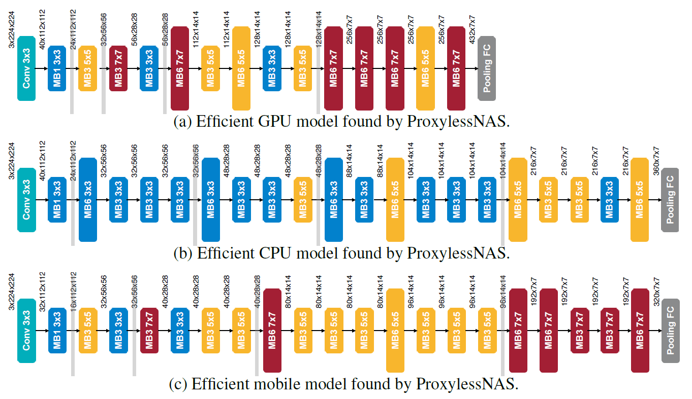

DataScienceLab

03/11/2020

Jaeyong Song

# CNN (basic, ResNet, NSA(SOTA))

### 1. 실습 목적

주변에 기본적인 CNN 실습 데이터들을 살펴보면 MNIST, Cifar-10이나 ImageNet을 이용한 실습이 많이 존재한다. 이보다는 캐글에 올라와 있는 데이터셋을 사용해보고 실습 파일을 가지고 있는 것이 추후에 프로젝트를 진행할 때 훨씬 유용하기 때문에 이를 실습 데이터셋으로 활용하였다. 최근에 CNN은 ResNet 등장 이후 이미 Accuracy가 굉장히 높아서 NAS(Neural Architecture Search) 기법 등이 활발하게 도입되고 있다. 이에 fruit-360 데이터에 4레이어 정도의 CNN, Resnet-50, proxylessNAS를 각각 이용하여 실습을 진행할 것이다. 과제로는 Kaggle에서 매우 유명한 데이터셋인 Chest X-Ray Images(Pneumonia)를 활용하였다.

### 2. 데이터셋 설명 및 환경 설명

<실습>

1. Fruits 360 (https://www.kaggle.com/moltean/fruits)
2. 이미지 수: 90483, 클래스수: 131 (계속 증가 중, 이용 버전: 2020.05.18.0), 이미지 크기: 100x100x3
3. 다양한 종류의 과일(같은 과일도 색과 종류에 따라)의 다양한 각도에서 찍은 사진을 이용한 분류 데이터셋
4. Pytorch를 이용하였으며, GPU는 RTX 2080Ti를 이용함.
5. 데이터 셋의 크기가 커서 첨부하지 못하였으며, 링크에서 다운 가능함.

<과제>

1. Chest X-Ray Images (Pneumonia) (https://www.kaggle.com/paultimothymooney/chest-xray-pneumonia)
2. 이미지 수: 5863, 클래스수: 2 (폐렴, 정상)
3. test, train, val 셋이 따로 있어서 실습에 용이
4. 데이터 셋의 크기가 커서 첨부하지 못하였으며, 링크에서 다운 가능함.

### 3. 적용한 알고리즘

3개의 방식 모두 learning rate를 줄여가면서 최대한 loss를 떨어뜨리는 수준까지 학습은 시키지 않았지만, 적당한 epoch내에서 모델이 최소 Loss에 근사하게 도달할 수 있도록 learning rate와 epoch 수를 정해서 학습.

#### 1. 기본 CNN: 3-4개의 Conv2d 레이어, 2개의 FC 레이어 (with Adam)

현재 이 데이터셋은 상당히 커졌는데 이전에 데이터셋이 작을 때의 결과들을 보니 3개의 Convolution 레이어로도 Accuracy가 97퍼센트 가량이 나왔다. 그런데 지금 커진 데이터셋으로 이 구조를 따라해보니 90퍼센트의 Accuracy가 나왔다. 그래서 기본적인 CNN 구조를 만들면서 convolution 레이어를 하나더 추가하였다. 그런데 처음에 일반 SGD로 학습을 시키니 Loss가 떨어지는 속도가 매우 느려서 Adam Optimizer를 이용하여 빠르게 Loss가 떨어질 수 있도록 하였다. 레이어의 구조는 아래와 같다.

```
1. Conv: kernelSize=3, stride=1, padding=1
   ReLU, MaxPooling: kernelSize=2, stride=2
   (100x100x3) -> (100x100x16) -> (50x50x16)
2. Conv: kernelSize=3, stride=1, padding=1
   ReLU, MaxPooling: kernelSize=2, stride=2
   (50x50x16) -> (50x50x32) -> (25x25x32)
3. Conv: kernelSize=3, stride=1, padding=1
   ReLU, MaxPooling: kernelSize=2, stride=2
   (25x25x32) -> (25x25x64) -> (12x12x64)
4. Conv: kernelSize=3, stride=1, padding=1
   ReLU, MaxPooling: kernelSize=2, stride=2
   (12x12x64) -> (12x12x128) -> (6x6x128)
5. FC
   (6x6x128) -> (625)
6. FC
   (625) -> (131)
```

```python
class CNN(torch.nn.Module):

    def __init__(self):
        super(CNN, self).__init__()
        self.keep_prob = 0.5
        # L1 ImgIn shape=(?, 100, 100, 1)
        #    Conv     -> (?, 100, 100, 16)
        #    Pool     -> (?, 50, 50, 16)
        self.layer1 = torch.nn.Sequential(
            torch.nn.Conv2d(3, 16, kernel_size=3, stride=1, padding=1),
            torch.nn.ReLU(),
            torch.nn.MaxPool2d(kernel_size=2, stride=2))
        # L2 ImgIn shape=(?, 50, 50, 16)
        #    Conv      ->(?, 50, 50, 32)
        #    Pool      ->(?, 25, 25, 32)
        self.layer2 = torch.nn.Sequential(
            torch.nn.Conv2d(16, 32, kernel_size=3, stride=1, padding=1),
            torch.nn.ReLU(),
            torch.nn.MaxPool2d(kernel_size=2, stride=2))
        # L3 ImgIn shape=(?, 25, 25, 32)
        #    Conv      ->(?, 25, 25, 64)
        #    Pool      ->(?, 12, 12, 64)
        self.layer3 = torch.nn.Sequential(
            torch.nn.Conv2d(32, 64, kernel_size=3, stride=1, padding=1),
            torch.nn.ReLU(),
            torch.nn.MaxPool2d(kernel_size=2, stride=2))
        # L4 ImgIn shape=(?, 12, 12, 64)
        #    Conv      ->(?, 12, 12, 128)
        #    Pool      ->(?, 6, 6, 128)
        self.layer4 = torch.nn.Sequential(
            torch.nn.Conv2d(64, 128, kernel_size=3, stride=1, padding=1),
            torch.nn.ReLU(),
            torch.nn.MaxPool2d(kernel_size=2, stride=2))

        # L5 FC 6x6x128 inputs -> 625 outputs
        self.fc1 = torch.nn.Linear(6 * 6 * 128, 625, bias=True)
        torch.nn.init.xavier_uniform_(self.fc1.weight)
        self.layer5 = torch.nn.Sequential(
            self.fc1,
            torch.nn.ReLU(),
            torch.nn.Dropout(p=1 - self.keep_prob))
        # L6 Final FC 625 inputs -> 131 outputs
        self.fc2 = torch.nn.Linear(625, 131, bias=True)
        torch.nn.init.xavier_uniform_(self.fc2.weight)

    def forward(self, x):
        out = self.layer1(x)
        out = self.layer2(out)
        out = self.layer3(out)
        out = self.layer4(out)
        out = out.view(out.size(0), -1)   # Flatten them for FC
        out = self.layer5(out)
        out = self.fc2(out)
        return out
```

learning rate 는 (0.01->0.001)로 설정하였고, 생각보다 Accuracy가 나오지 않아서 epoch은 20 epoch을 돌린 후 learning rate 재조정 후 추가 20epoch을 돌렸다. (lr 조정 관련된 코드는 실습에서 설명) 배치 사이즈는 GPU 메모리에에 최대로 올릴 수 있는 배치 사이즈인 1024를 설정하였다.

#### 2. Resnet-50 (with SGD)

Resnet은 bottleneck과 block 개념을 이용해서 기존의 CNN을 확장한 NN 구조이다. 앞에 이론에서 설명하였듯이, 여태까지 있어온 구조들 중 매우 훌륭한 편이고 최근 트렌드를 보면 높은 Accuracy를 보여주는 구조들 중 상당수가 Resnet의 기본 구조를 가지고 만들어져 있기에 Resnet을 적용해보았다. 더 큰 크기의 Resnet-110도 있지만 모델 크기가 너무 크기 때문에 Resnet-50를 이용하였다. 모델은 파이토치에서 import 하여 사용하였으며 pretrained=True로 하여 학습하였다. 또한 learning rate 는 0.001로 설정하였고, SGD 모멘텀은 0.9, epoch은 20으로 설정하였다. 배치 사이즈는 기본 CNN과 마찬가지로 GPU 메모리에 최대한 올릴 수 있도록 512를 설정하였다.

#### 3. Proxyless NAS (with SGD)

NN의 아키텍쳐를 설계하는 일은 상당히 까다롭고 시간이 오래걸리는 작업이다. 소규모 업체 등 설계에 시간과 비용을  많이 투자하기 어려운 경우 자신들의 데이터와 상황에 딱 맞는 모델을 설계하기가 어렵다. 이에 따라서 NAS(Neural Architecture Search) 방법이 나왔고 이전까지는 모델을 생성하고 한번 돌려보고 하는 식으로 이루어진 NAS 개념이 많아 시간이 굉장히 오래 결렸지만, Proxyless NAS와 그 이전의 몇 논문들이 새로운 방식을 도입하여 이 시간을 획기적으로 줄였다. 예를 들어 `3x3, 5x5, 7x7`등의 conv 블럭을 선택하려고 하고 이에 가중치를 둔다. 학습을 통해 가장 최적화된 블럭을 계속 선택해 나간다. 그런데 이렇게 되면 모델의 크기가 무한정 커지고 이에 따라 학습시간이 매우 오래 걸리기 때문에 모델을 한번 도는데 걸리는 `latency*람다`를 Loss에 집어넣어 현재 딥러닝을 돌리는 기기에 최적화된 모델을 찾는다. 그래서 최근 NAS 기법은 Mobile 기기 등에 적용하기 매우 유용하다. 이번 Final Project에서는 proxyless 논문에서 GPU에 적절하다고 찾아낸 모델을 가지고 학습을 진행하였다. 논문에서 찾아낸 각 기기에 알맞은 모델은 아래와 같다.



그런데 논문에서는 최적화된 결과를 얻기 위해서는 Searching을 진행한 조건과 동일하게 Input Normalizaion과 Resizing을 진행하라고 하였다. 그런데 이렇게 되면 기본 CNN, Resnet 실험과 동일한 조건이 아니게 되므로, Input   Normalization을 한 학습과 하지 않은 학습을 둘다 진행하였다.

learning rate는 0.001, SGD 모멘텀은 0.9, 배치 사이즈는 non-normalization의 경우는 512, nomalization의 경우는 이미지 리사이징(256x256)도 진행하기 때문에 128로 설정하였다. epoch은 20 epoch을 돌렸다.

### 4. 실습과정 및 결과

자신의 모델을 만들고 이를 최대한 better fitting을 위해 레이어 수 조정, 파라미터 설정 등을 해보기 위해 기본 CNN에서는 Accuracy를 최대한 높일 수 있도록 노력해 보았고, 나머지는 실습에 대한 전체적인 결론을 내릴 수 있을 정도로만 학습을 진행하였다.

#### 1. 기본 CNN: 3-4개의 Conv2d 레이어, 2개의 FC 레이어 (with Adam)

처음에 3개의 Convolution 레이어로 구성된 모델을 만들었지만, Accuracy 가 90퍼센트도 나오지 못하였다. 따라서 최소한 한개의 Convolution Layer를 추가해보자 생각하여 1개의 Layer를 더 추가하여 진행하였다. 제대로 실험하기 전 임상 실험에서는 SGD와 learning rate=0.001를 이용하였는데, Loss가 떨어지는 속도가 매우 느려 epoch을 너무 많이 돌려야할 것으로 예상되었다. 

제대로된 첫 실험에서는 learning rate를 0.01로 높이고 Adam Optimizer를 이용하고 레이어를 하나 더 추가하였다. 이후에는 Loss가 떨어지는 모습이 관찰되었고, 20epoch을 돌려보았다. 20 epoch을 돌린 결과는 93.00%의 Accuracy가 나왔다. 이 때 Loss가 떨어지는 경향이 지속되고 있었기 때문에 저장된 체크포인트 상태에서 epoch을 더 돌리거나 learning rate를 더 미세하게 바꾸면 더 높은 Accuracy를 얻을 수 있을 것 같아 두번째 실험을 진행하였다.

두번째 실험에서는 첫 실험에서 저장한 체크포인트를 불러와 learning rate=0.001을 적용하고 20epoch을 추가로 돌렸다. 그랬더니 Loss가 감소하였고 최종 Accuracy는 94.85%에 도달하였다.

#### 2. Resnet-50 (with SGD)

Resnet의 경우는 처음에 learning rate를 0.01로 돌렸더니 96%의 Accuracy가 나왔다. 그런데 Loss가 더 낮아질 수 있을 것 같아 체크포인트를 이용하지 않고 learning rate를 0.001로 20epoch을 돌려 97.02%의 Accuracy가 나왔다.  Loss의 추세를 보았을 때, learning rate를 더 낮추면 조금의 Accuracy를 높일 수 있겠지만, 이 데이터셋이 크기가 커진 뒤의 최근 결과를 보면 97%가 Resnet으로 낼 수 있는 Accuracy의 한계인 듯 하여 실험을 여기서 마쳤다.

#### 3. Proxyless NAS (with SGD)

Proxyless NAS의 경우에는 Input Normalization을 한 것과 하지 않은 것 두가지로 진행하였다. 논문에서 제안하는 리사이징과 Normalization은 다음과 같다.

```python
trans = transforms.Compose([
    transforms.Resize(256),
    transforms.CenterCrop(224),
    transforms.ToTensor(),
    transforms.Normalize(mean=[0.485, 0.456, 0.406], std=[0.229, 0.224, 0.225]),
])
```

우선 Input Normalization을 진행하지 않은 실험에서는 20epoch을 돌렸을 때 98.24%의 Accuracy를 보였으며 learning rate를 미세하게 하면 약간 더 낮아질 듯 하였다. 하지만, 이미 이 상태로도 다른 모델과 비교하기에 충분하여 실험을 여기서 마쳤다.

리사이징과 Input Normalization을 진행한 경우에는 20epoch을 돌렸을 때 Accuracy가 99.22%가 나왔다. 이 경우도 learning rate를 낮추면 조금 더 낮아질 것 같았지만, 비교에는 충분하여 실험을 여기에서 마쳤다.

#### 4. 모델 사이즈 비교

직접 계산하여 모델의 파라미터 수를 셀 수도 있지만, 직관적인 비교를 위해 저장된 체크포인트의 크기를 비교하였다.  결과적으로 기본 CNN < proxylessNAS < Resnet-50 순으로 크기가 무거웠다.


### 5. 종합적 분석

| 모델        | 기본 CNN  | Resnet-50 | proxylessNAS    |
| ----------- | --------- | --------- | --------------- |
| 크기(MB)    | 11.675781 | 97.74707  | 27.392578       |
| Accuracy(%) | 94.85(%)  | 97.02(%)  | 99.22, 98.24(%) |

종합적으로 보면 proxylessNAS의 Accuracy가 압도적으로 높았으며, Accuracy대비 모델의 크기도 작았다. 이를 통해, 모델의 크기가 크다고 해서 무조건 높은 Accuracy를 보장하는 것이 아니라는 것을 알 수 있었다. 또한 점점 모델 아키텍쳐 구성도 사람이 직접 하는 것이 아니라 학습을 통해 할 수 있게 되고 있다는 것을 실감할 수 있었다.

기본 CNN의 경우 현재 4개의 레이어로 할 수 있는 한 최대한 Accuracy를 올린 것이라고 할 수 있다. 이번 과제에서는 기본 CNN의 Accuracy를 높이기 위해 3가지를 진행했다.

1. 체크포인트를 활용해서 learning rate 0.01 -> 0.001로 조정하여 추가 epoch
2. Optimizer 변경 (SGD -> Adam)
3. 레이어 추가 (3레이어 -> 4레이어)

만약 Accuracy를 더 올리고 싶다면 레이어를 추가하거나 아니면 Resnet, VGG 등의 확장된 CNN 모델을 활용하면 될 것으로 보인다.

추가적으로, 캐글에 CNN의 Accuracy를 위한 Trick들이 가득 담긴 예시가 있는데 그런 것들을 찾아보는 것도 도움이 된다.(Normalization, Flip 등의 기법) 하지만 가장 중요한 것은 훌륭한 모델을 이용하는 것이다.

### 6. 참고사항

이렇듯, ResNet 기반의 모델이 나오면서 CNN의 Accuracy가 크게 증가하였으며, 최근에는 NAS 기법 등을 통해서 더욱 Accuracy가 증가하고 있다. 그런데, 실제 프로젝트에서는 이미지의 크기도 크고, 굉장히 많은 데이터를 처리해야해서 위의 실습보다 Training 시간이 훨씬 크게 소요된다. 따라서, 이를 가속하기 위한 분산처리 기법들이 많이 사용된다. NAS 또한 Accuracy에도 중점이 있지만, 환경에 맞는 빠른 처리를 위해서도 이용된다. 대표적인 분산처리에는 Model 분산과 Data 분산이 있는데, 주로 Data 분산이 쓰인다. 이를 위한 파이토치 라이브러리는 DDP로 이용할 일이 발생하면 검색해보면 된다. CNN 분야는 변화가 빨라서, 관심이 있으신 분들은 최신 논문들을 접하는 것이 공부에 가장 좋은 방법이다.


### #)참고문헌

#### ProxylessNAS 관련

논문: https://arxiv.org/pdf/1812.00332.pdf

Github: https://github.com/MIT-HAN-LAB/ProxylessNAS

Pytorch HUB: https://pytorch.org/hub/pytorch_vision_proxylessnas/

#### fruit-360 다른 Kaggle 결과 (작은 크기였을 때)

https://www.kaggle.com/aninditapani/cnn-from-scratch-with-98-accuracy

#### 좋은 예시

https://www.kaggle.com/micheledifazio/fruitsss-pytorch-resnet-99

#### 결과 및 체크포인트

결과: 소스코드와 같이 첨부된 txt 파일에 있습니다.

기본 CNN: https://drive.google.com/open?id=1fTKZQUOB042tOsdoSHc9_TMEWQ8Lx1gA

Resnet-50: https://drive.google.com/open?id=1zsJyuT24u49XMAEsBSfbz6z5zsKBfzbE

ProxylessNAS(unnorm): https://drive.google.com/open?id=15JiKXzXWLJ7yjr7AynfEndFGmsEseA-F

ProxylessNAS: https://drive.google.com/open?id=161TkD54nE1Lt3l8OJ0nYKsfL6NQk1gmF